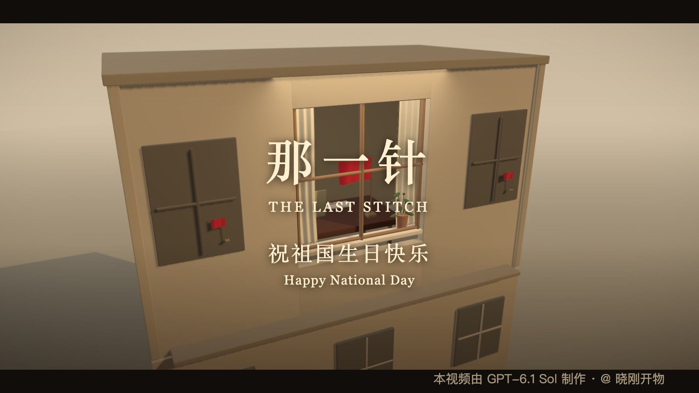
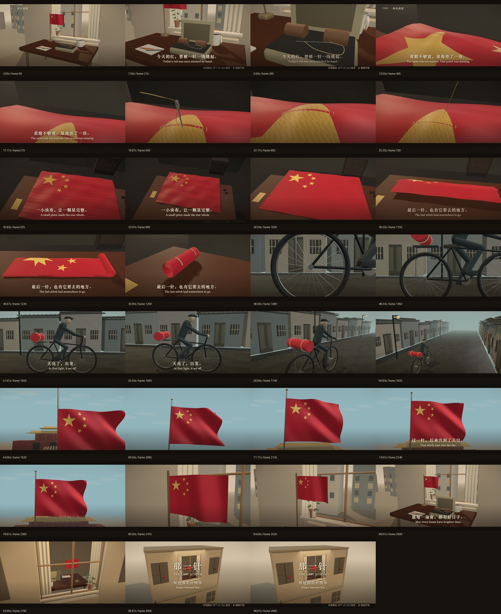

# 那一针 · The Last Stitch

**这一针，后来升到了天空。**

一部为中国国庆创作的 100 秒微缩 CG 故事短片。用一枚针、一块布、一次自行车送旗，把历史中的一个小细节，带回今天普通人家的窗边。

无旁白，音乐与拟音推进叙事，配少量中英双语字幕。由 **GPT-6.1 Sol** 协助完成叙事、分镜、三维场景、代码动画、剪辑与声音编排；创作者 **@ 晓刚开物**。配乐采用已有授权曲目，详细来源见 [素材说明](docs/credits.md)。

[](https://github.com/jasonz1987/gpt6-video-the-last-stitch/raw/refs/heads/main/videos/national-day-the-last-stitch.mp4)

## 观看与下载

| 版本 | 内容 | 下载 |
| --- | --- | --- |
| 完整配乐版 | 音乐＋拟音＋中英字幕＋制作署名 | [下载最终 MP4 · 47.4 MB](https://github.com/jasonz1987/gpt6-video-the-last-stitch/raw/refs/heads/main/videos/national-day-the-last-stitch.mp4) |
| 仅拟音版 | 保留拟音、字幕和署名，方便另配音乐 | [下载最终 MP4 · 45.9 MB](https://github.com/jasonz1987/gpt6-video-the-last-stitch/raw/refs/heads/main/videos/national-day-the-last-stitch-sfx-only.mp4) |

两版均为 **骑行修正版**，采用相同画面。规格：**100 秒 · 1920 × 1080 · 16:9 · 30 fps · 3000 帧 · H.264 / AAC · 48 kHz 双声道**。

仓库只保留这两份最终成片、对应源码和必要制作资料。旧样片、错误版本、重复导出、依赖目录与渲染缓存未收录。

下载仓库后，不安装制作依赖也能观看：

```sh
python3 -m http.server 8773 --bind 127.0.0.1
```

打开 <http://127.0.0.1:8773/preview.html>，可播放、切换声音版本并下载。

## 故事与分镜

今天的晨光照进窗边，一面小旗旁放着旧针线盒。镜头沿着一枚针走入往事：黄缎幅宽不足，星角需要拼接；针穿过布面，缺口合拢。旗面被折好、卷起，随自行车经过街巷，在十月一日午后升向天空。红旗再与今天窗边的小旗相接，最后落到一句祝福：**愿每一扇窗，都有好日子。**

| 时间 | 镜头 | 画面与动作 |
| --- | --- | --- |
| 00–12 秒 | 今日的窗边 | 晨光、小旗、茶杯；推进旧针线盒 |
| 12–18 秒 | 少了一角 | 暖色缝制间，找到星角接缝 |
| 18–36 秒 | 那一针 | 微距穿针、拉线、合拢，退开见完整旗面 |
| 36–45 秒 | 装好出发 | 折旗、卷旗、收紧麻绳 |
| 45–50 秒 | 车轮 | 低机位贴近车轮、脚踏与石路 |
| 50–57 秒 | 送旗 | 侧向跟拍，灰墙与瓦檐形成空间层次 |
| 57–62 秒 | 抵达 | 看向车后布卷，再抬向巷口 |
| 62–70 秒 | 升起 | 午后，旗面沿旗杆升起 |
| 70–80 秒 | 天空 | 仰视红旗，风沿布面传递 |
| 80–91 秒 | 回到今天 | 大旗切回窗边小旗，露出针线盒与热茶 |
| 91–100 秒 | 每一扇窗 | 镜头退到窗外，片名、祝福与署名落定 |

完整时间线和字幕见 [src/timeline.ts](src/timeline.ts)，创作规格见 [production-spec.json](production-spec.json)。下图直接取自最终 MP4：

<details>
<summary>展开最终成片分镜联系表</summary>



</details>

## 制作方式

使用 **Remotion 4.0.530、React 19、Three.js 与 React Three Fiber**。几何、旗面、织物、街巷和日常物件由代码构建，镜头与动作按帧驱动，可逐帧重现。针线使用微距景别，自行车使用连续跟拍，布面使用程序变形。人物采用简化雕塑造型。

最终修订包含骑行曲柄转向、鞋尖朝向、前掌与脚踏接触、双腿固定长度的两段式运动学；同时修复了镜头切换时的单帧暗闪。配乐剪辑与拟音事件保存在可编辑脚本和 JSON 中。

## 本地编辑与导出

制作环境需要 **Node.js 22、Python 3.10+、FFmpeg / ffprobe**，以及支持 WebGL 的 Chrome Headless Shell。实际交付在 macOS 上渲染；中文使用系统宋体 `Songti SC / STSong`，英文使用 Georgia。其他系统需安装相应可用字体或修改 [Film.tsx](src/Film.tsx) 的字体设置，字形和换行可能与成片不同。

```sh
git clone git@github.com:jasonz1987/gpt6-video-the-last-stitch.git
cd gpt6-video-the-last-stitch
npm ci

python3 -m venv .venv
source .venv/bin/activate
python3 -m pip install -r requirements.txt

# 校验素材，并从 Mixkit 官方地址获取配乐到本地
npm run assets

# 生成 100 秒音乐、拟音与混音 WAV
npm run audio

# 打开 Remotion Studio，选择整片或单个分镜
npm run dev
```

公开仓库包含 CC0 拟音、HDR 光照和程序生成贴图。**原始配乐 MP3 与派生音乐 WAV 不单独分发**；`npm run assets` 根据 [素材清单](public/asset-sources.json) 从官方地址获取并校验文件。使用该配乐须遵守 [Mixkit Stock Music Free License](https://mixkit.co/license/modal/musicFree/) 和 [User Terms](https://mixkit.co/terms/)。

```sh
# 检查源码类型
npm run typecheck

# 先导出关键帧，查看光照、机位和字幕
npm run stills

# 渲染整片，分别封装配乐版和仅拟音版
npm run render

# 校验仓库中的最终成片
npm run check:export

# 校验自己重新渲染的成片
python3 scripts/check-export.py --video out/national-day-the-last-stitch.mp4
```

重新导出的 MP4 位于 `out/`，不会覆盖仓库的 `videos/` 最终成品。静帧、打包缓存和重新检查的证据位于 `.render-cache/`。初次渲染会获取 Chrome Headless Shell；也可用 `STITCH_CHROME_EXECUTABLE` 指定已有可执行文件。

渲染先生成画面，再用 FFmpeg 将帧零起点的 WAV 封装为 AAC。CPU/GPU、字体、编码器和软件环境会影响重新导出的字节结果；随仓库提供的校验值只针对已发布文件。

## 源码导览

```text
src/
  Film.tsx           整片画面、字幕、署名与音轨
  Root.tsx           整片和 11 个单镜头 Composition
  timeline.ts        分镜、时间点与中英字幕
  Scenes.tsx         窗边、卷旗、街巷、骑行和升旗场景
  World.tsx          缝制间与针线镜头
  objects.tsx        旗面、针线盒与日常物件
  motion.ts          帧驱动的缝合动作与插值
  cycling.ts         曲柄、脚踏与腿部姿态
  Materials.tsx      织物与木材
  RenderReady.tsx    等待三维画面完成绘制
scripts/             素材准备、声音编排、渲染与检查
public/              必要素材、来源清单与封面
videos/              两份最终 MP4
docs/                分镜预览、素材说明与验收记录
qa/                  最终技术报告与骑行修订证据
```

## 成片验证

最终成片已解码 **3000 帧**，未发现开场/收尾淡出以外的异常黑帧，或正常切点以外的异常全局亮度跳变。两版全部视频包哈希一致；三处音频时差测量均为 **0 帧**。骑行修订的 **510 帧** 已与完整成片逐帧比对，修改范围外 **2490 个视频包**保持不变。

检查范围、视觉复核和已知限制见 [验收记录](docs/quality.md) 与 [骑行独立复核](qa/cycling-independent-review.md)。音频结论限于信号、时差和峰值测量。

```sh
# 在仓库根目录验证发布视频完整性
shasum -a 256 -c videos/SHA256SUMS
```

## 史实与创作边界

第一面五星红旗的大星因黄缎幅宽不足而拼接一角，完成后曾由自行车送出，参考 [中国国家博物馆记录](https://www.chnmuseum.cn/zx/gbxw/201909/t20190926_155297.shtml)。首次升旗为 **1949 年 10 月 1 日下午 3 时**，第一面旗尺寸 **460 × 338 厘米**，参考 [馆藏说明](https://www.chnmuseum.cn/portals/0/web/zt/fuxing/picture_atc_34.html)。

现代窗边、针线盒、针的传承、具体接缝、匿名人物、街巷与建筑均为叙事创作。影片以史实细节为起点，并未逐场重建历史，也未声称片中物件是真实文物。用户提供的参考视频用于前期讨论，本片未使用其影像、音轨、诗句或逐镜头安排。

素材各自适用原许可；本项目源码当前标记为 `UNLICENSED`，未另行授予通用开源许可。详见 [素材来源与许可](docs/credits.md)。

**本视频由 GPT-6.1 Sol 制作 · @ 晓刚开物**
